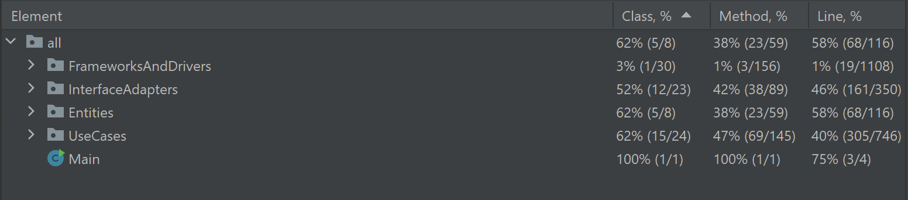

# Employee Management Software
### By: MAWA

## Project description:
This Java 8 application allows you to:\
As an HR worker
- Schedule shifts for your employees
- Receive and respond to time-off requests from your employees
- Keep track of payments to your employees
- Create records for new employees
- Mark existing employees as inactive (and reactivate them)\
As an Employee
- See shifts that you are scheduled for
- Request shifts off
- See if HR has accepted/denied your request
- See past payments
- See a summary of your employee information

This project currently only saves data locally, so data persistence is limited to 
one device. We are working towards having the data being stored on the web. 
There is also still input validation that needs to be done.
## How to Install and Run the Application
- [ ] Clone this repo (git clone https://github.com/CSC207-2023Y-UofT/course-project-mawa.git)
- [ ] Run the "Main" file (in src/main/java directory)
## Dependencies
This project is a gradle repository built using SDK version corretto-11.0.20.\
The GUI uses Java Swing.
Testing is dependent on JUnit5, Instancio, and Mockito.

## Using the application
If there are no users in "users.ser", you will be prompted to
create a new HR account. You can then log in with the HR
account and create new Employees as an HR user. Once there are new
employees saved, these employees can log in with their
Employee Numbers and Passwords.\
From the login, you will see a Home Page of buttons that will
lead to either a Calendar, Notification Center, Payment History, 
or Employee Information (depending on if HR or Employee is logged in).\
As of now, there may only be one HR account (with Employee Number of 1), but there can be many Employee accounts.\
Data from:
- users are stored in "users.ser"
- shifts are stored in "shifts.ser"
- payments are stored in "payments.ser"
- notifications are stored in "notifications.ser"

## Testing
Most of the testing coverage is applicable to the UseCase, InterfaceAdapter, and Entity layers.
As well, even though we have many GUI classes, they don't have much testable logic contained in them (as per SRP, CA, and MVP),
so we focused our testing efforts in the lower three layers.\
JavaDoc is sparse in our testing modules because we have designed the tests to be quite simple (as aided by CA) and adequately explained by
their method names.
Our testing coverage is:

(current bug, you may have to clear users.ser,payments.ser, notifications.ser, and shifts.ser after sunning tests because someone in our group didn't have enough time to implement their tests to write to the test files)

## Software Design
The classes are packaged into their CA layers to help with
software development. Due to this packaging decision, all of the GUI 
dependent classes are in FrameworksAndDrivers, so making the application
look prettier is no issue.\
The key design patterns used in the project are MVP(for most GUI Pages), and 
the Singleton Design Pattern for the ____FileReader classes. The Facade 
Design Pattern is used within some InterfaceAdapter classes (such as getXCoord() in 
DayCellPresenter directly calling DayCellModel's getXCoord()
to allow the DayCell that exists in the FrameworksAndDrivers layer to access
UseCase level information).\
Despite the tight coupling between some GUI elements, our UseCases are able to
operate pretty independently. 

## How to Contribute
We welcome all suggestions for how to improve the design of our software (this is our
first GitHub project)! We are still students and are looking to make this application more
professional.\
To add to the repo, please clone it and make a pull request with your improvements. We may or may not 
accept it, but we will try to converse you about what you think should be changed/added.\
We are also open to comments on our code (CA violations, Code Smells, other opportunities for
refactoring, feature requests). 
If you would like to have your code incorporated into the project, please email one of us.

## Credits
Main Programmers:\
(MAWA)\
Megan Ding: megan.ding@mail.utoronto.ca\
Ahmad Khazan: ahmad.khazan@mail.utoronto.ca\
William Boitor: william.boitor@mail.utoronto.ca\
Alinikan Agharezakashi: alinikan.agharezakashi@mail.utoronto.ca\

Thank you to Radian Gondokaryono for providing us with guidance during the 
design process and support with timely feedback! (and a stellar grade...pls)

